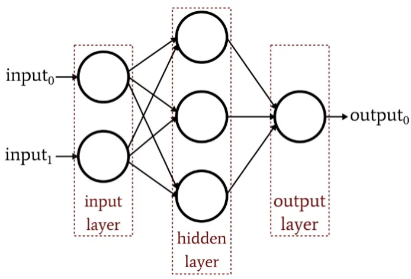
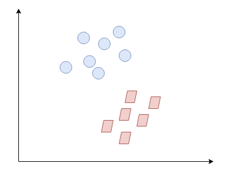
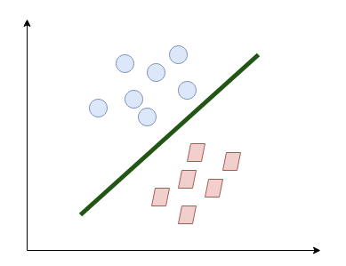
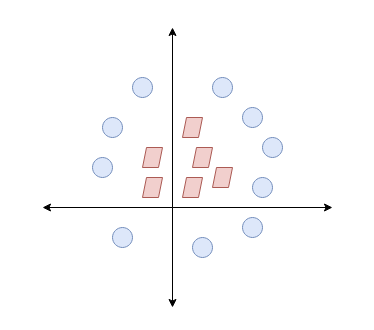
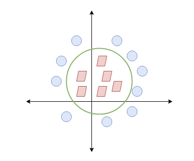
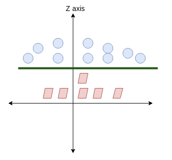
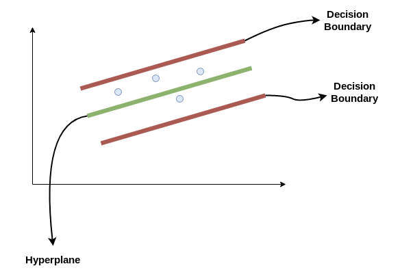
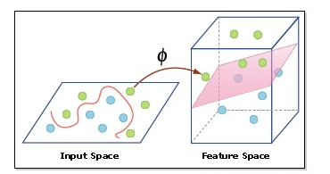

## Project Overview

- In this project, we want to determine which machine learning regression model provides the most accurate prediction based on the given dataset.
- Based on the results, MLP NN (Multi-Layer Perceptron Neural Network) gives the best accuracy and the shortest training-time due to the structure of the model.
- The regression models that are used in this project include: Elastic Net, Lasso (L1), Multi-Layer Perceptron Neural Network(MLPNN), Ridge (L2), Support Vector Regression (SVR)
- [Link to this Project on Github](https://github.com/ewang58/Machine-Learning-Fibre-Classification-Regression)

## Description

- In this project, a set of training data (~80%) set and testing data (~20%) are given. Each data contains a 2-dimensional label which denotes the cotton and the polyester content in the fabric respectively. 
- We will build and train 5 different regression models to determine which models gives the best performance in terms of prediction error and efficiency.
- We will use the mean absolute error (MAE) as our benchmark to compare each model.

## Python Libraries

I have installed Anaconda Python distribution installed on my system. This is included with most standard Python libraries required for this project. Some libraries used in this project are:

- Pandas: provides necessary tools for data manipulation, storage and analysis tasks.
- Numpy: provides a simple numerical array structure and functions
- Seaborn:provides the necessary plotting functions for Pandas data frames.
- Matplotlib: is the basic plotting tools in Python for data presentation.
- Scikit-learn: provides simple data preprocessing tools.
- Pytorch: provides fast and flexible tools for training and testing the given datasets.


## Regression Metric: MAE

The mean absolute error (MAE) is "a measure of errors between paired observations expressing the same phenomenon" which can be calculated as:
$$
MAE = \frac {\sum^n_{i=1}|y_i-x_i|}{n}=\frac{\sum^n_{i=1}|e_i|}{n}
$$
In python, this can be written as a function, such as:

````python
class Metrics:
    def mae(y_pred, y_true):
        return np.mean( np.abs( np.subtract(y_pred, y_true) ) )
````


## Exploratory data analysis

In this project, a set of training and testing data in a 80% and 20% split are provided to predict the amount of polyester in the material. The dataset is relatively big with 2701 records and 1307 features. Therefore, we need to start with understanding and cleaning the data first. In the following steps, I will share a few techniques to help with understanding and cleaning the data. 

### Null Values

We have to check there is no empty values (null values) to ensure a good quality of data. There are several ways that we can conduct this

#### Visualization method

Firstly we can visualize the data with a heatmap that is generated by Seaborn. 

````python
cols =df.columns[:] #all columns

colours = ['#000099', '#ffff00'] 
# specify the colours - blue is missing. yellow is not missing.

# generating a heatmap using seaborn
sns.heatmap(df[cols].isnull(), cmap=sns.color_palette(colours))
````

#### Mechanical method

However a drawback of this method is that it can take quite a bit of time in a large dataset like this. But mechanically we can also calculate for missing data by running the code on top. And if the result comes back with a positive integer that means we have a missing value. Hence we can run the code below to see the missing data percentage and its location. 

```python
# check to see if any null value (missing value) is present or not
df.isna().any().sum()

# check for missing data percentage list

# if it's a larger dataset and the visualization takes too long, perform this 

for col in df.columns:
    pct_missing = np.mean(df[col].isnull())
    print('{} - {}%'.format(col, round(pct_missing*100)))
```


## Multi-Layer Perceptron Neural Network

### Understanding MLP

A multi-layer perceptron neural network (MLP NN) is a combination of networks composed of multiple layers of "vanilla" neural networks (the perceptrons). An MLP consists of an input layer, an output layer and at least one hidden layer. 



Each layer (except for the input layer) uses a neuron that uses a nonlinear activation function called sigmoids:
$$
\theta(z) = \frac {1}{1+e^{-z}}
$$

### Set up

In this regression, the structure of our MLP has an input layer ( of 1307 neurons), two hidden layers( of 128 neurons and 64 neurons respectively) and an output layer (of 2 neurons). The regression has a learning rate of 0.0001 with a max epochs of 100.

```python
# Define our MLP-NN.
class MLPNN(nn.Module):
    def __init__(self):
        super(MLPNN, self).__init__()

        self.layers = nn.Sequential(
            nn.Linear(1307, 128),
            nn.ReLU(),
            nn.Linear(128, 64),
            nn.ReLU(),
            nn.Linear(64, 2),
        )

    def forward(self, x):
        return self.layers(x)
```

### Loss Function

Next, we can then set up a loss function using mean squared error (MSE) which is the most commonly used loss function:

```python
criterion = nn.MSELoss()
```

### Optimizer

We can also set up our learning rate and an optimizer using ``torch.optim``:

````python
optimizer = torch.optim.Adam(model.parameters(), lr=0.0001)
````

### Train the model

We can then write our function that trains the model, and keeping in the mind the run time to help us better analyze the efficiency:

````python
start = datetime.datetime.now()

for epoch in range(100):
    train_loss = 0
    for features, targets in train_dataloader:
        optimizer.zero_grad()

        predictions = model( features.float() )

        loss = criterion( predictions.float(), targets.float() )
        loss.backward()

        optimizer.step()

        train_loss += loss.item()
        
end = datetime.datetime.now()
training_time = end - start
print(f"Training time: {training_time}")
````

### Result

After running the model and performing the prediction, we can calculate the mean absolute error metric which comes back at **MAE: 0.02537**


## Support Vector Regression

### Understanding the SVR

A support vector regression has a similar concept as a support vector machine which uses a hyperplane to separate between the two classes. 


Suppose we have the following two datasets, denoted in blue circles and red squares:



The quickest way to separate them in a 2-dimensional space is through a straight line:



It is what SVM essentially does. It will also work in a more difficult circumstances:



We can see that the easiest way to separate the two datasets is by drawing a circle between them, which can be relatively hard to apply:



Instead, we can increase the dimensionality by adding a z axis, thereby, we are able to apply an hyperplane in between the two sets:



The same logic apples to SVR but in the form of regression. We are trying to find the best hyperplane which has a maximum number of points within the decision boundary. 





### set up, training and prediction

We are going to set up three different SVR and compare them: linear SVR, polynomial SVR and RBF SVR:

```python
y_dimension = np.shape(train_y[1])[0]

svr_linear = [SVR(kernel="linear", C=100, gamma="auto") for _ in range(y_dimension)]

svr_polynomial = [SVR(kernel="poly", C=100, gamma="auto", degree=2, epsilon=0.1, coef0=1) for _ in range(y_dimension)]

svr_rbf = [SVR(kernel="rbf", C=100, gamma=0.1, epsilon=0.1) for _ in range(y_dimension)]
```

We can then train and predict our models:

```pythong
# Train each SVRs
for index in range(y_dimension):
    svr_linear[index].fit(train_X, train_y[:, index])
    svr_polynomial[index].fit(train_X, train_y[:, index])
    svr_rbf[index].fit(train_X, train_y[:, index])
```

```python
# Get the predictions for each SVR
svr_linear_pred = []
svr_polynomial_pred = []
svr_rbf_pred = []
for index in range(y_dimension):
    svr_linear_pred.append( svr_linear[index].predict(test_X) )
    svr_polynomial_pred.append( svr_polynomial[index].predict(test_X) )
    svr_rbf_pred.append( svr_rbf[index].predict(test_X) )
```

### Result

The MAE from the 3 SVRs are relatively close to each other despite using a different kernel function, with the liner SVR being the most accurate and RBF SVR being the least accurate:

| Regression     | MAE     |
| -------------- | ------- |
| Linear SVR     | 0.03561 |
| Polynomial SVR | 0.03660 |
| RBF SVR        | 0.04258 |


## L1: Lasso

### Basic Understanding

Lasso regularization is designed to enhance prediction accuracy. It penalize the model when it is overfitting. The basic mathematical form is shown blow:
$$
min\ \frac1{2n} ||wX-y||^2_2+\alpha||w||_1
$$
It is also called L1 because it refers to [Minkowski norms](https://en.wikipedia.org/wiki/Minkowski_space) and $$L^P$$ Spaces where $$P$$ is the Euclidean distances by the following expression:
$$
||x||_p=(|x_1|^P+|x_2|^p+...+|x_n|^P)^{\frac 1 P}
$$

### Setup

We can conveniently use the ``sklearn`` package sklearn to do achieve this:

```python
from sklearn.linear_model import Lasso
from sklearn.multioutput import MultiOutputRegressor
regressor = MultiOutputRegressor( Lasso(alpha=0.1) )
```

### Result

The MAE score on L1 is **0.13249**.

## L2: Ridge

### Basic Understanding

Similar to Lasso, ridge is also a regularization that can help improve the accuracy of the prediction. It is more efficiently at preventing models from under-fitting. The basic mathematical form can be written as below:
$$
min\ \frac1{2n} ||wX-y||^2_2+\alpha||w||_2^2
$$

### Setup

We can use the ``sklearn`` library to conveniently code this as:

````python
from sklearn.linear_model import Ridge
from sklearn.multioutput import MultiOutputRegressor
regressor = MultiOutputRegressor( Ridge(alpha=0.25) )
````

### Result

The MAE score on L2 is **0.02395**


## Elastic Net

### Basic understanding

The elastic net is also a regularized regression that combines **both L1 and L2**. Therefore this method penalizes the model when the regression is either overfitting and/or under-fitting. An estimation of the elastic net in Lagrangian form can written as below:
$$
\hat \beta \equiv argmin(||y-X\beta||^2+\lambda_2||\beta||^2+\lambda_1||\beta||_1)
$$

### Setup

From the ``sklearn`` library, there is a function that can also be used: 

```python
from sklearn.linear_model import ElasticNet
from sklearn.multioutput import MultiOutputRegressor
predictions = regressor.predict(test_X)
```

### Result

The result of MAE comes back as **0.17037**

## Interpreting the Results

| Regression                            | MAE     |
| ------------------------------------- | ------- |
| Multi-Layer Perceptron Neural Network | 0.02537 |
| Linear SVR                            | 0.03561 |
| Polynomial SVR                        | 0.03660 |
| RBF SVR                               | 0.04258 |
| Lasso                                 | 0.13249 |
| Ridge                                 | 0.02395 |
| Elastic Net                           | 0.17037 |


- We can see that MLP out-performs all other regression models with the least MAE while Lasso regression has the worst performance. 
- MLP shows a better result might be due to the ability to manually tune the number of hidden neurons, layers and iterations until it reaches its optimal point.
- One purposed possibility that causes Lasso to show less efficiency might be because Lasso generally creates sparse outputs which directly increases the MAE metrics.
- You can access the source code [here](https://github.com/ewang58/Machine-Learning-Fibre-Classification-Regression/tree/main/Code)


[Back to Main](https://ewang58.github.io/My_Data_Science_Portfolio/)
